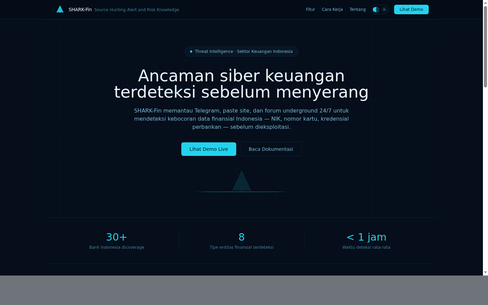
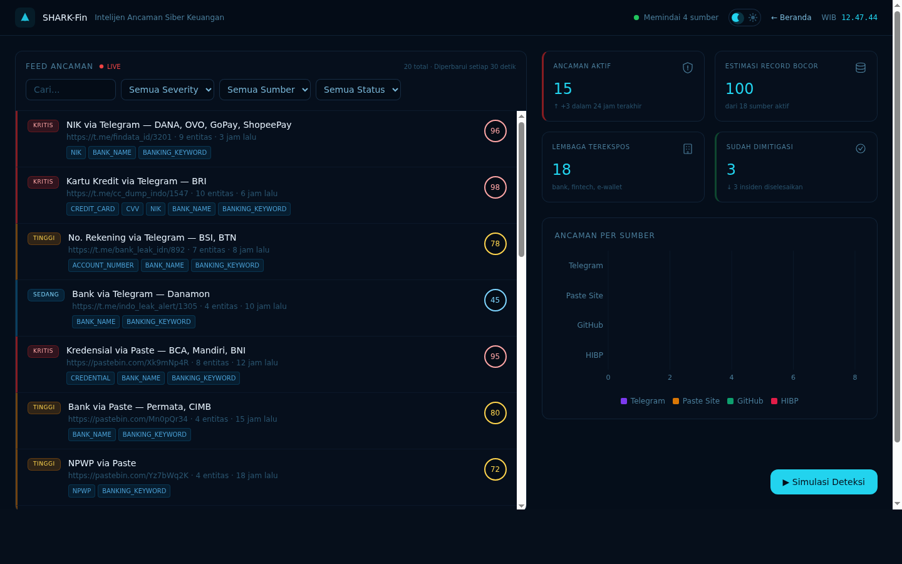

# SHARK-Fin

**Source Hunting Alert and Risk Knowledge for Financial Intelligence**

> Platform intelijen ancaman siber keuangan berbasis OSINT untuk ekosistem keuangan digital Indonesia

PIDI DIGDAYA x Hackathon 2026 | PS1: Cyber Security & Data Protection

---

### Landing Page


### Dashboard Analis


---

## Masalah

Menurut data BSSN, Indonesia mengalami lebih dari 400 juta anomali trafik siber pada tahun 2023, dengan sektor keuangan menjadi target utama. OJK mencatat peningkatan 53% kasus kebocoran data nasabah di industri perbankan dan fintech sepanjang 2024-2025. Data kartu kredit, NIK, NPWP, dan kredensial internet banking Indonesia secara rutin diperjualbelikan di kanal Telegram, paste site, dan dark web — seringkali terdeteksi oleh pelaku kejahatan lebih cepat daripada oleh lembaga keuangan itu sendiri.

Saat ini, tidak ada platform terpusat yang secara proaktif memonitor sumber-sumber publik (OSINT) untuk mendeteksi kebocoran data keuangan Indonesia secara real-time. Lembaga keuangan dan regulator (BI, OJK, BSSN) membutuhkan early warning system yang mampu mendeteksi, mengklasifikasi, dan melaporkan ancaman siber keuangan sebelum data yang bocor disalahgunakan secara masif.

## Solusi

SHARK-Fin adalah platform intelijen ancaman siber yang secara otomatis:
1. **Mengumpulkan** data dari sumber publik (Telegram, Pastebin, GitHub, HIBP)
2. **Mengklasifikasi** konten menggunakan regex pattern khusus Indonesia (kartu kredit dengan validasi Luhn, NIK dengan validasi tanggal, NPWP dengan checksum)
3. **Menilai risiko** dengan scoring engine multi-faktor (0-100)
4. **Menyiapkan draft** notifikasi awal mengacu SEOJK 29/SEOJK.03/2022 Bab IX untuk membantu bank memenuhi kewajiban notifikasi 24 jam ke OJK

## Arsitektur

```
                    SUMBER DATA (OSINT)
          +----------+----------+----------+----------+
          | Telegram | Pastebin |  GitHub  |   HIBP   |
          +----+-----+----+-----+----+-----+----+-----+
               |          |          |          |
               v          v          v          v
         +------------------------------------------------+
         |            COLLECTOR LAYER                      |
         |  Telethon  |  httpx   |  PyGithub  |  httpx    |
         +---------------------+---+----------------------+
                               |
                               v
         +------------------------------------------------+
         |           CLASSIFIER + SCORER                   |
         |  Regex Patterns (ID-specific)  |  Risk Scorer   |
         |  - Kartu Kredit (Luhn+BIN)     |  - Base weight |
         |  - NIK (date validation)       |  - Volume mult |
         |  - NPWP (checksum)             |  - Freshness   |
         |  - Kredensial, CVV, Rekening   |  - Source cred  |
         |  - Dedup (SHA-256)             |                |
         +---------------------+---+----------------------+
                               |
                               v
         +------------------------------------------------+
         |              DATABASE LAYER                     |
         |         PostgreSQL  |  Redis (queue/cache)      |
         +---------------------+---+----------------------+
                               |
               +---------------+---------------+
               v                               v
    +---------------------+         +---------------------+
    |    REST API (FastAPI)|         |  Dashboard (React)  |
    |  /threats            |<------->|  Landing page       |
    |  /threats/{id}/report|         |  ThreatFeed         |
    |  /stats/summary      |         |  StatCards          |
    |  /alerts/webhook     |         |  SourceChart        |
    +---------------------+         +---------------------+
               |
               v
    +---------------------+
    | Draft Notifikasi OJK|
    | (SEOJK 29/2022 IX)  |
    +---------------------+
```

## Quick Start

```bash
# Clone dan jalankan
git clone <repo-url> && cd shark-fin

# One-command demo setup
chmod +x scripts/demo_setup.sh
./scripts/demo_setup.sh

# Atau manual:
cp .env.example .env
docker compose up -d --build
docker compose exec backend python -m scripts.seed_demo
```

Akses:
- **Landing Page**: http://localhost:5173
- **Dashboard**: http://localhost:5173/dashboard
- **API Docs**: http://localhost:8001/docs
- **Health Check**: http://localhost:8001/health

## Fitur Utama

- **Real-time Threat Feed** — Monitor ancaman siber keuangan dari 4 sumber OSINT dengan auto-refresh 30 detik
- **Deteksi Data Keuangan Indonesia** — Pattern matching khusus untuk kartu kredit (BIN Indonesia + Luhn), NIK (validasi tanggal+provinsi), NPWP (checksum), nomor rekening, kredensial
- **Risk Scoring Engine** — Skor 0-100 dengan multiplier volume, freshness, dan kredibilitas sumber
- **Dashboard Analis** — Interface Bahasa Indonesia dengan filter severity/sumber/status, detail ancaman, dan entity breakdown
- **Landing Page** — Public-facing page dengan ocean theme untuk presentasi ke stakeholder
- **Draft Notifikasi OJK** — Generate draft notifikasi awal mengacu SEOJK 29/SEOJK.03/2022 Bab IX, membantu bank memenuhi kewajiban notifikasi 24 jam ke OJK
- **Laporan Intelijen Internal** — Generate laporan teknis lengkap (entitas, confidence, raw preview, risk factors) untuk tim keamanan bank
- **Status Workflow** — Alur kerja analis: Baru → Terverifikasi → Dimitigasi / Positif Palsu
- **Export Insiden** — Download laporan per ancaman sebagai file .txt
- **Deduplication** — SHA-256 hash untuk mencegah duplikasi data
- **API RESTful** — Endpoint lengkap dengan filter, paginasi, dan dokumentasi Swagger

## Alignment: PIDI PS1 — Cyber Security & Data Protection

| Kriteria PIDI | Implementasi SHARK-Fin |
|---|---|
| Deteksi ancaman siber | Real-time monitoring 4 sumber OSINT |
| Perlindungan data keuangan | Pattern detection khusus instrumen keuangan Indonesia |
| Early warning system | Auto-classification + risk scoring + alerting |
| Regulatory compliance | Draft notifikasi awal mengacu SEOJK 29/2022 Bab IX |
| Kolaborasi stakeholder | API untuk integrasi dengan sistem BI, OJK, BSSN |

## Tech Stack

| Layer | Teknologi | Fungsi |
|---|---|---|
| Backend | Python 3.11 + FastAPI | REST API, classifier, scoring engine |
| Database | PostgreSQL 16 | Penyimpanan threat intelligence |
| Cache | Redis 7 | Queue dan caching |
| Collectors | Telethon, httpx, PyGithub | Pengumpulan data OSINT |
| Classifier | Regex + validasi (Luhn, NIK date, NPWP checksum) | Deteksi data keuangan |
| Frontend | React 18 + Vite + TailwindCSS | Landing page + dashboard analis |
| Visualisasi | Recharts | Grafik dan statistik |
| Container | Docker + Docker Compose | Deployment |

## API Endpoints

| Method | Endpoint | Deskripsi |
|---|---|---|
| GET | `/api/v1/threats` | Feed ancaman (filter, paginasi) |
| GET | `/api/v1/threats/{id}` | Detail ancaman |
| PATCH | `/api/v1/threats/{id}/status` | Update status (workflow analis) |
| GET | `/api/v1/threats/{id}/report?format=ojk` | Draft notifikasi awal SEOJK 29/2022 |
| GET | `/api/v1/threats/{id}/report?format=intel` | Laporan intelijen internal |
| GET | `/api/v1/stats/summary` | Statistik dashboard |
| POST | `/api/v1/alerts/webhook` | Registrasi webhook alert |
| GET | `/health` | Health check |

## Catatan Legal & Etika

SHARK-Fin **hanya** memonitor sumber-sumber yang dapat diakses secara publik (publicly accessible sources). Platform ini:

- **Tidak** melakukan akses tidak sah ke sistem manapun
- **Tidak** menyimpan data asli (semua nilai sensitif di-mask)
- **Tidak** mendistribusikan data yang ditemukan ke pihak ketiga
- Digunakan **hanya** untuk tujuan defensif: melindungi nasabah dan lembaga keuangan
- Sesuai dengan prinsip responsible disclosure dan UU PDP (Perlindungan Data Pribadi) Indonesia

---

*SHARK-Fin — Melindungi ekosistem keuangan digital Indonesia melalui intelijen ancaman siber proaktif.*
